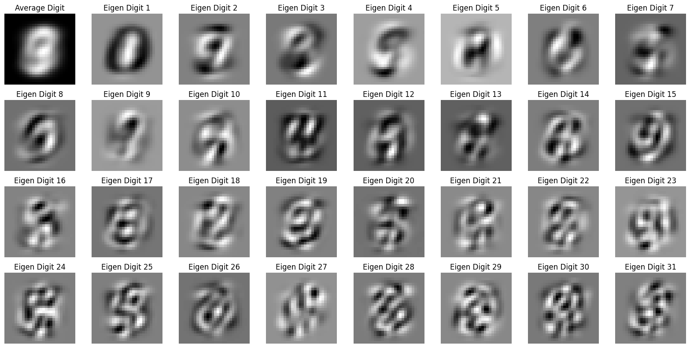
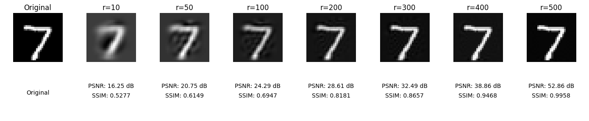
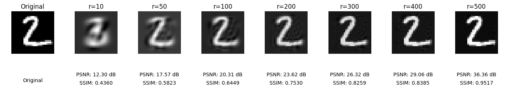
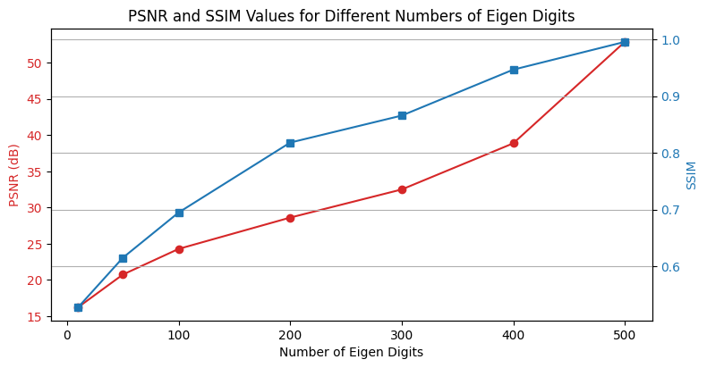
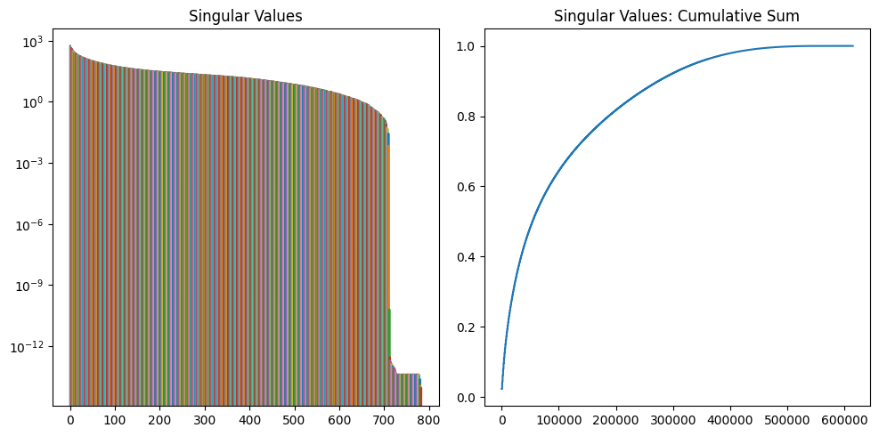
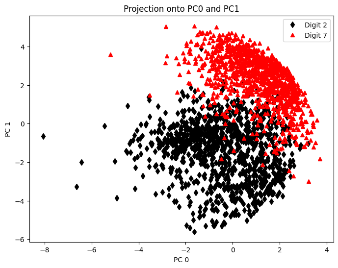
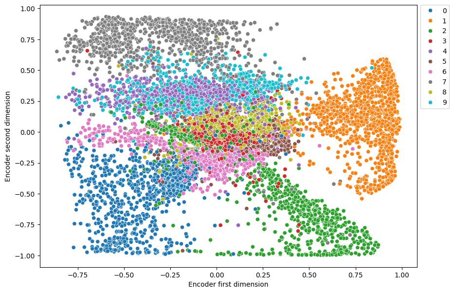

# Comparison between PCA and Autoencoders

## Principal Component Analysis (PCA)

Principal Component Analysis (PCA) provides a hierarchical coordinate system to represent high-dimensional correlated data. This coordinate system involves the correlation matrices.

**NOTE:** The convention for $X$, consisting of rows of features, is different from the convention throughout the remainder of this notebook, where individual images are arranged as columns.

### Computation

To compute PCA, the following steps are taken:

1. **Mean Calculation:**
   The row-wise mean $\bar{x}$ (i.e., the mean of all rows) is calculated and subtracted from $X$. The mean $\bar{x}_j$ is given by:

   $$ \bar{x}_j = \frac{1}{n} \sum_{i=1}^{n} X\_{ij} $$

   where $n$ is the number of observations (rows) and $X_{ij}$ represents the value at the $i$th row and $j$th column.

2. **Mean Matrix:**
   The mean matrix $\bar{X}$ is constructed with each row being $\bar{x}$:

   $$ \bar{X} = \begin{bmatrix} \bar{x} \\ \vdots \\ \bar{x} \end{bmatrix} $$

3. **Subtracting the Mean:**
   Subtracting $\bar{X}$ from $X$ results in the mean-subtracted data $B$:

   $$ B = X - \bar{X} $$

4. **Covariance Matrix:**
   The covariance matrix $C$ of the rows of $B$ is then computed as:

   $$ C = \frac{1}{n-1} B^\top B $$

   This represents the covariance between the different features.

PCA then proceeds to find the eigenvalues and eigenvectors of the covariance matrix $C$. The eigenvectors (principal components) give the directions of maximum variance, and the eigenvalues give the magnitude of the variance in those directions. The data can then be projected onto these principal components to reduce its dimensionality while preserving as much variance as possible.

### First Principal Component

The first principal component $u_1$ is given as:

$$ u_1 = \underset{\|u_1\|=1}{\text{argmax}} \; u_1^\top B^\top B u_1, $$

which is the eigenvector of $B^\top B$ corresponding to the largest eigenvalue. Now it is clear that $u_1$ is the left singular vector of $B$ corresponding to the largest singular value.

It is possible to obtain the principal components by computing the eigen-decomposition of $C$:

$$ CV = VD, $$

which is guaranteed to exist, since $C$ is Hermitian.

## Understanding Eigendigits Through PCA

### Image Preprocessing for PCA

Before PCA can be applied, each image within our dataset is transformed into a large column vector. We then calculate the average image and use this to center our dataset by subtracting it from each image vector. This mean subtraction is crucial as it ensures that the first principal component represents the direction of maximum variance. These centered image vectors are then horizontally concatenated to form the data matrix $X$.

### Performing Singular Value Decomposition (SVD)

To extract meaningful patterns from our image data, we perform Singular Value Decomposition (SVD) on the mean-centered matrix $X$:

$$ X = U\Sigma V^ \ast \approx \widetilde{U}\widetilde{\Sigma}\widetilde{V}^ \ast, $$

Here, $U$ contains our eigenvectors—or "eigendigits"—which can be reshaped back into the original image dimensions of 28×28 pixels. The tilde notation ($\widetilde{}$) indicates that we are working with a subset of the matrix, representing a reduced number of singular values and vectors for a more efficient representation.

### Visualization of Eigendigits

The matrix $\widetilde{U}$ holds the left singular vectors corresponding to the most significant singular values—our principal components. These vectors can be visualized as images, providing an intuitive look at the core patterns within our dataset.

### Reconstruction of Test Images

To test the effectiveness of our PCA model, we use the following projection to reconstruct an image not included in our training dataset:

$$ \widetilde{x}_{\text{test}} = \widetilde{U} \widetilde{U}^\ast x_{\text{test}}. $$

### Quantitative Analysis of Image Reconstruction

Our analysis demonstrates that by retaining the top 500 principal components, we achieve a Structural Similarity Index (SSIM) score of approximately 0.995—a near-perfect reconstruction with a data reduction of 31.3%.

A second example from our test dataset shows how PCA allows for effective image projection and compression.

The plot above highlights the correlation between the number of eigen digits used and the quality of image reconstruction, as measured by PSNR and SSIM.

### Significance of Eigenvalues

The plateau in the cumulative sum of singular values illustrates the diminishing returns of adding additional principal components. This suggests that a compact representation of the image data is possible with minimal loss of information, affirming the efficiency of PCA for such tasks.

### Scatter plot PCA

The scatter plot illustrates the clustering of data for two different classes (digit 2 and digit 7) when projected onto the first two principal components (PC0 and PC1). The two classes appear to form distinct clusters, with digit 2 represented by black diamonds and digit 7 by red triangles, showing how PCA can effectively reduce dimensionality and separate different types of data in the transformed feature space.

