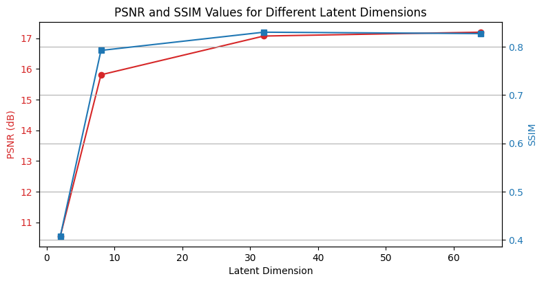

# Comparison between PCA and Autoencoders

## Principal Component Analysis (PCA)

Principal Component Analysis (PCA) provides a hierarchical coordinate system to represent high-dimensional correlated data. This coordinate system involves the correlation matrices.

**NOTE:** The convention for $X$, consisting of rows of features, is different from the convention throughout the remainder of this notebook, where individual images are arranged as columns.

PCA then proceeds to find the eigenvalues and eigenvectors of the covariance matrix $C$. The eigenvectors (principal components) give the directions of maximum variance, and the eigenvalues give the magnitude of the variance in those directions. The data can then be projected onto these principal components to reduce its dimensionality while preserving as much variance as possible.

### First Principal Component

The first principal component $u_1$ is given as:

$$u_1 = \underset{\|u_1\|=1}{\text{argmax}} \; u_1^\top B^\top B u_1,$$

which is the eigenvector of $B^\top B$ corresponding to the largest eigenvalue. Now it is clear that $u_1$ is the left singular vector of $B$ corresponding to the largest singular value.

It is possible to obtain the principal components by computing the eigen-decomposition of $C$:

$$CV = VD,$$

which is guaranteed to exist, since $C$ is Hermitian.

## Understanding Eigendigits Through PCA

### Image Preprocessing for PCA

Before PCA can be applied, each image within our dataset is transformed into a large column vector. We then calculate the average image and use this to center our dataset by subtracting it from each image vector. This mean subtraction is crucial as it ensures that the first principal component represents the direction of maximum variance. These centered image vectors are then horizontally concatenated to form the data matrix $X$.

### Performing Singular Value Decomposition (SVD)

To extract meaningful patterns from our image data, we perform Singular Value Decomposition (SVD) on the mean-centered matrix $X$:

$$X = U\Sigma V^ \ast \approx \widetilde{U}\widetilde{\Sigma}\widetilde{V}^ \ast,$$

Here, $U$ contains our eigenvectors—or "eigendigits"—which can be reshaped back into the original image dimensions of 28×28 pixels. The tilde notation $\widetilde{}$ indicates that we are working with a subset of the matrix, representing a reduced number of singular values and vectors for a more efficient representation.

### Visualization of Eigendigits

The matrix $\widetilde{U}$ holds the left singular vectors corresponding to the most significant singular values—our principal components. These vectors can be visualized as images, providing an intuitive look at the core patterns within our dataset.

### Reconstruction of Test Images

To test the effectiveness of our PCA model, we use the following projection to reconstruct an image not included in our training dataset:

### Quantitative Analysis of Image Reconstruction (PCA)

Our analysis demonstrates that by retaining the top 500 principal components, we achieve a Structural Similarity Index (SSIM) score of approximately 0.995—a near-perfect reconstruction with a data reduction of 31.3%.

A second example from our test dataset shows how PCA allows for effective image projection and compression.

The plot above highlights the correlation between the number of eigen digits used and the quality of image reconstruction, as measured by PSNR and SSIM.

### Significance of Eigenvalues

The plateau in the cumulative sum of singular values illustrates the diminishing returns of adding additional principal components. This suggests that a compact representation of the image data is possible with minimal loss of information, affirming the efficiency of PCA for such tasks.

### Scatter plot PCA

The scatter plot illustrates the clustering of data for two different classes (digit 2 and digit 7) when projected onto the first two principal components (PC0 and PC1). The two classes appear to form distinct clusters, with digit 2 represented by black diamonds and digit 7 by red triangles, showing how PCA can effectively reduce dimensionality and separate different types of data in the transformed feature space.

## Dimensionality Reduction Using Autoencoders

Autoencoders serve as a nonlinear dimensionality reduction technique where a neural network is trained to learn a compact representation of data. This is achieved through two key components: the encoder, which compresses the data, and the decoder, which reconstructs the data from the compressed form.

The training process involves minimizing the reconstruction loss, which is the difference between the original data and its reconstruction. This process enables the network to discover an informative latent representation automatically.

The efficacy of the latent representation is influenced by various factors, including the number of hidden layers, the number of neurons per layer, the size of the latent vector, the choice of activation functions, the optimizer, the learning rate, epochs, batch size, and more. These are collectively known as the hyperparameters of the autoencoder model.

In this study, we focus on the impact of the latent vector size on the quality of the compressed representation. We examine four different autoencoders, all with identical hidden layer configurations but varying latent vector sizes: [2, 8, 32, 64]. While keeping encoder units `[512, 256, 128]` and decoder units `[128, 256, 512]` constant, we assess the image reconstruction quality using PSNR (Peak Signal-to-Noise Ratio) and SSIM (Structural Similarity Index) and contrast the results with those obtained from PCA (Principal Component Analysis).

### Quantitative Analysis of Image Reconstruction (Autoencoder)

The comparative analysis reveals that an increase in the latent space dimension enhances the clarity of the reconstructed images. With only two dimensions, the latent space struggles to capture the essence of the images. However, as the dimensionality increases to 64, the reconstructed images closely resemble the originals, suggesting that a larger latent space can better compress information. It's important to note that the improvement in image quality becomes marginal when comparing latent spaces of 32 and 64 dimensions. This suggests a saturation point for the model, indicating that further improvements might require tweaking other hyperparameters, such as network depth or activation functions.

The image above illustrates the progression of reconstruction quality with increasing latent space dimensions.

A second example from the test dataset reinforces our findings.

The graph above shows that as the dimensions in the latent space increase, both the PSNR and SSIM scores improve and eventually plateau, supporting our hypothesis.

### Visualization of the Latent Space

The scatter plot for the 64-dimensional latent space demonstrates distinct separation of most classes, capturing significant variance and illustrating the model's ability to discern different digit classes effectively.

## Comparing PCA and Autoencoders

When comparing PCA and autoencoders using the same test image, it becomes evident that autoencoders can capture a substantial amount of information even in a reduced latent space. This is attributed to the introduction of nonlinearity through the neural network layers, which allows for a richer and more nuanced representation than what is achievable with PCA's linear transformation.

The images above showcase the comparative reconstruction capabilities of PCA and an autoencoder for an identical test image. The autoencoder's reconstruction is markedly superior, demonstrating the advantages of leveraging neural networks for dimensionality reduction tasks.
